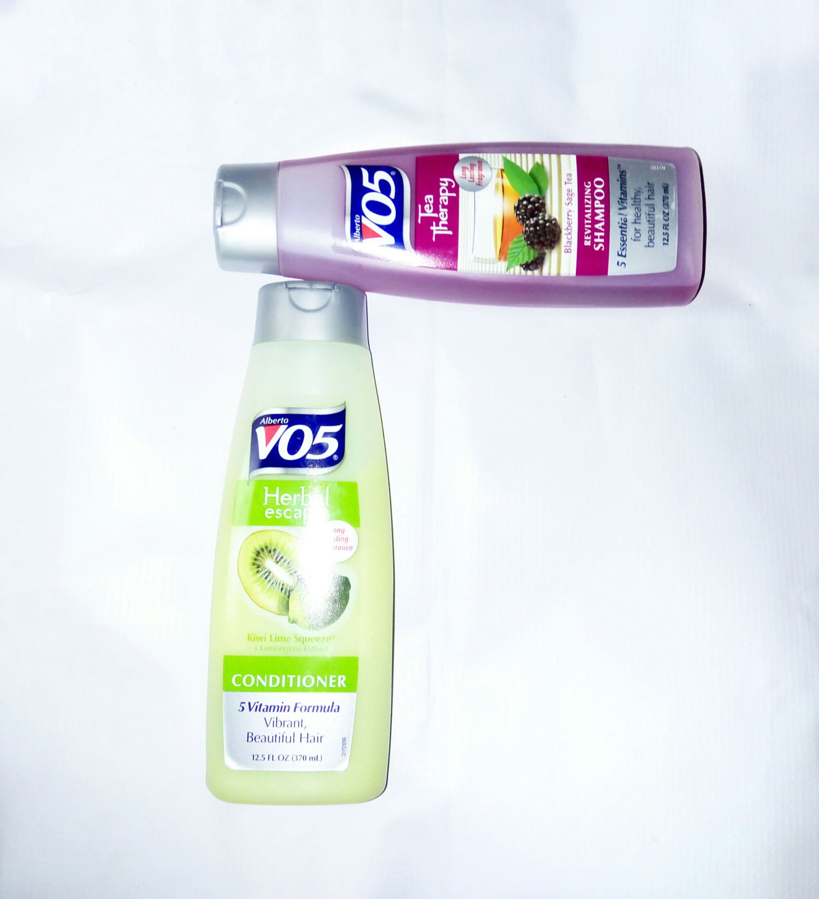

_I whip my hair back and forth_ 

I don't even have a long hair to _whip_, but hopefully in two years time I'd be _whipping_ it continuously.

It's been 2 months and few weeks since I took a courageous step and cut my pretty long and thick hair so as to start a virgin (natural) hair journey. Since then, my hair has been giving me little to no stress until some few weeks back when I found out that I had dandruff. Also, shrinkage and dryness have been a major problem for me. So I decided to treat it. Fact that I had a tight budget made me conclude on doing or making a home made remedy. Something that wouldn't cost me much.

Today's post is going to be about the homemade deep conditioner I tried out few days ago. I was moved by how soft and shinny some virgin hair looked so I made some researches and got me some recipes to make a healthy and natural deep conditioner for my virgin hair.

The result I got out of it was really impressing. It got many people admiring how soft my hair was and made them ask me questions like "didn't you cut your hair like a month or two ago?" "Did you perm it?" And so on.

My major aim was to share with other girls who keep natural virgin hair ways at which they can take proper care of their hair without stress.

Not to talk much, I'll be dropping the ingredients and materials I used and processes to follow. _Note_: My hair isn't too long so I used less of the ingredients listed below so as to prevent wastage.

**Ingredients**

1.  2 eggs
2. Natural honey
3. A ripe avocado
4. 2 pieces of ripe banana
5. Coconut milk
6. Coconut oil
7. Virgin Olive oil
8. Butter
9. Shea butter
10. Peak milk
11. Vegetable glycerin
12. Clean bowl and spoon/fork

**Procedures**

- Break your eggs into a bowl
- Add 2 teaspoons of coconut oil and Virgin Olive oil
- 3 teaspoons of Coconut milk
- 2 teaspoons of peak milk
- 3 teaspoons of honey
- Stir together
- Add your banana and stir till it turns into a smooth paste
- Add your avocado and also stir into a paste again
- Add your glycerin, Shea butter and Butter
- You might not be able to stir properly as required so make use of a blender. _I_ _used a blender_
- Blend well until you have a paste like this

- After you mix, I'd advice that you seive the mixture in other for you to make it free from any tiny or unwanted properties.

Above are the materials and ingredients.

- Make sure to co wash your hair properly and detangle it.
- Dry it
- Share your hair into sections and apply the mixture from the root of your hair to the tip. Make sure to put in enough
- After you do this, cover your hair with a shower cap or a plastic bag
- Let the mixture sit in for a couple of hours. Mine sat in for 2 hours and some minutes.
- Take off the plastic bag and wash your hair properly.
- Dry it with a clean towel
- Apply coconut oil or Shea butter to the hair
- Comb and style as desired

This is the shampoo and conditioner I make use of and they are really good.

 

I hope this works for you like it did for me.

Pretty hurts

But babe, Endure.

_Xoxo_
