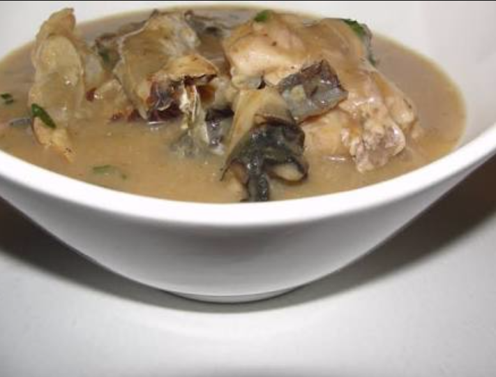
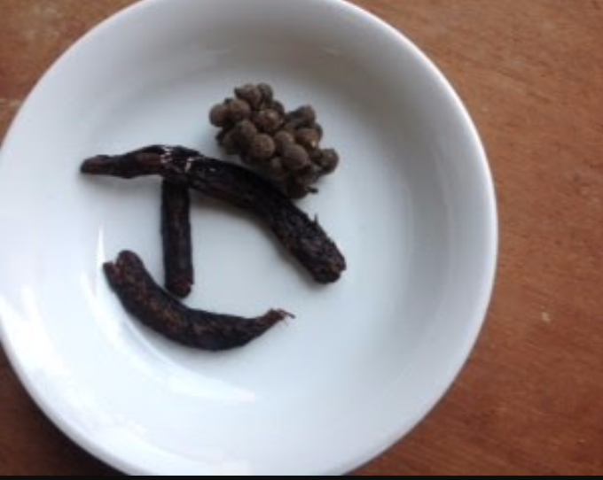

_Happy New Month to you all_

_February, yet another wonderful month. Its valentine soon so let godly love flow in the air._

_Today, I'd be writing about an African Dish so stay put._

African dishes are so yummy I could go literally go high on them. My blog is not based on food blogging but my love for food moved me to do some blogging about it. First, excess of food and junk makes one add weight “and look like an agric fowl”, I’m quoting my younger brother, I couldn’t stop laughing while quoting this. As I was typing, you tend to add weight when you take in too much food, well this is only for some people. Others don’t even add a kilo \*_I wish I was one of them_

African dishes are so legit, like they are the bomb. I’m not hyping them but all of you know that what I’m saying here is true. We have different languages and ethnic groups in Nigeria and all of them have their own native food. I haven’t tasted even half of the food in the place I stay, well I’m planning to. So, moving to the real deal, the first food I’d blog on or give out the recipe is  Ofe Nsala, a native soup of the Igbos. I mentioned this soup in my [Previous post](https://lilistargazer.wordpress.com/2016/12/24/christmas-eve/) ….  And I got requests for the recipe so I’d be giving that to you now. Also, there’s more to come.

Ofe Nsala popularly known as White Soup is an African Igbo delicacy. For me it looks like pepper soup but it is thicker, rich and more nutritious. It is a 45 minutes food journey though, depending on the flesh you use (Cat fish, Dry fish or Chicken). To prepare this soup you need the following **items**:

- Uda seed
- Uziza seed

- Utazi leaf
- Dry fish, Fresh fish or Chicken
- Thickener (yam, flour or )
- Salt
- Seasoning (maggi and onga)
- Cameron pepper

**Steps to follow:**

Note: in my house we use either Cat fish, Dry fish or chicken, nothing else.  Also, the thickener ranges from Yam to Flour and Uli. Most people use Yam. It depends on the one you are able to get or comfortable with.

- Wash the chicken, Fresh fish or Dry fish
- Set the preferred flesh in the pot
- Add your ingredients and enough water to boil. Mind you, the amount of water you use to boil the flesh is what you’ll use for the soup.
- Pound your uda seed and  Seed with your cray fish and Cameroon pepper.
- Also, boil a few pieces of yam, pound into a smooth paste, make them in balls. For the flour, mix it with water, make sure it's seed free and thick.
- When the flesh is boiling add the thickener (the pounded yam, flour or uli) and the pounded seeds
- After 5-9 minutes add your uziza leave if required.
- Boil for another 3 minutes before putting it down.

This is my own recipe, my aunties say, this recipe is for pregnant women but who cares. You can decide to ditch the long seeds. It’ll still come out the same. Now, you can serve with either pounded yam, akpu or semovita. I haven’t tried it with amala or garri so beware. _Lol_

That’s all for Ofe Nsala. There’s more from where this came from. Keep your fingers crossed. Before I forget, while writing this, I had only Fatima in mind. Her request for the food really moved and touched me **__fakes cry and wipes it__** lol

Happy Birthday to my younger brother, Kingsley. A younger bro who acts like d older brother I never had. Wishing you a  belated birthday. Loves and kisses baby😍😍

_Until next time 💫💫💫_

_**XoXo**_

_Ada’s_ _**Kitchen**_
