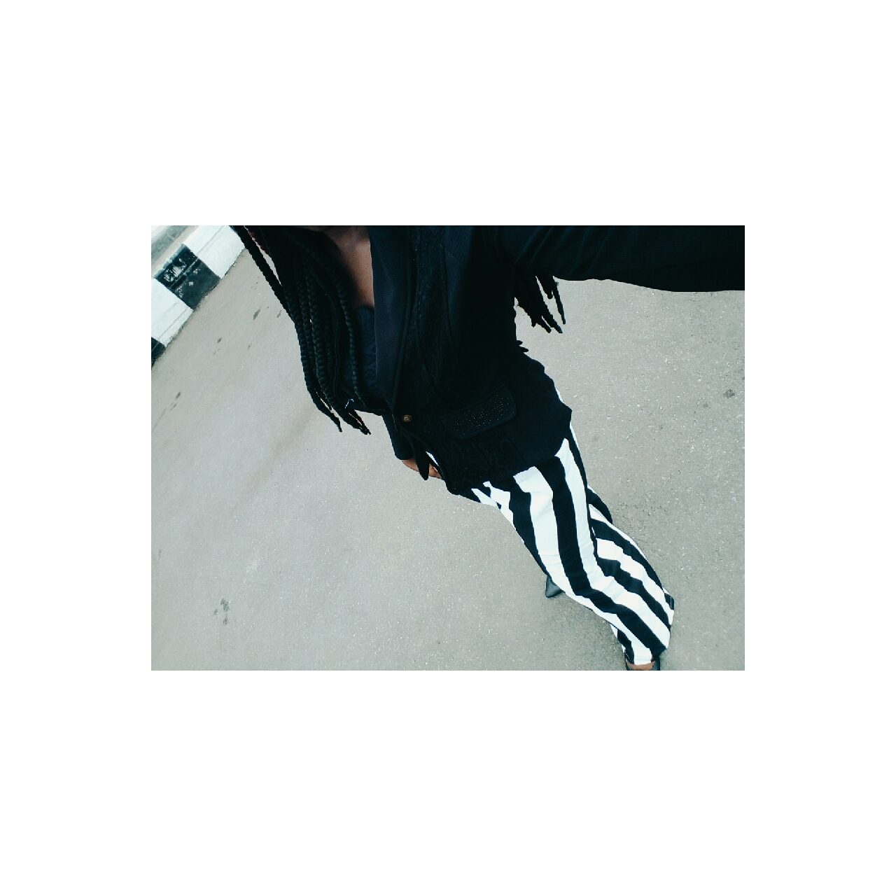

Happy New Month to all my lovely followers, fans and supporters. The beginning of yet another wonderful month in 2017. May this month bring good news and better outcomes,  Amen. 

_I'll start first by saying welcome to DTC members and thank you.  Today's post is dedicated to y'all at DTC._

I haven't posted in two weeks and it feels like two months, been busy preparing myself for my approaching exams (a lie I tell myself) and also building ideas to develop my blog. 

I fell in love with a material I found in the market, it is a bold monochrome stripped material, looking so fine. I decided I was going to put myself to the test and sew something lovely out of it. First thing that came to mind was a wide leg jumpsuit but I decided to make it into a blouse and trouser. 

\[caption width="2000" align="alignnone"\]❤✌❤\[/caption\]

I made the trouser but I got help from my grandma (she's a pro seamstress) and she made the top. I styled this design of mine in three ways

\[caption width="1280" align="alignnone"\]Liliannnn❤\[/caption\]

\[caption width="2000" align="alignnone"\]Puhleaseee ☝\[/caption\]

\[caption width="2000" align="alignnone"\]The Boss Lady❤\[/caption\]

\[caption width="1280" align="alignnone"\]Cash me outside👉\[/caption\]

\[caption width="1280" align="alignnone"\]Condition made crayfish bend ☝\[/caption\]

\[caption width="1280" align="alignnone"\]Muahhh❤\[/caption\]

This is it,  thanks to the photographer who did me well. I'm really excited, another piece to my Chic et Classic collection. Hope to be consistent this month. 

_Until next time_

_**XoXo**_

_Which look seems better?_
