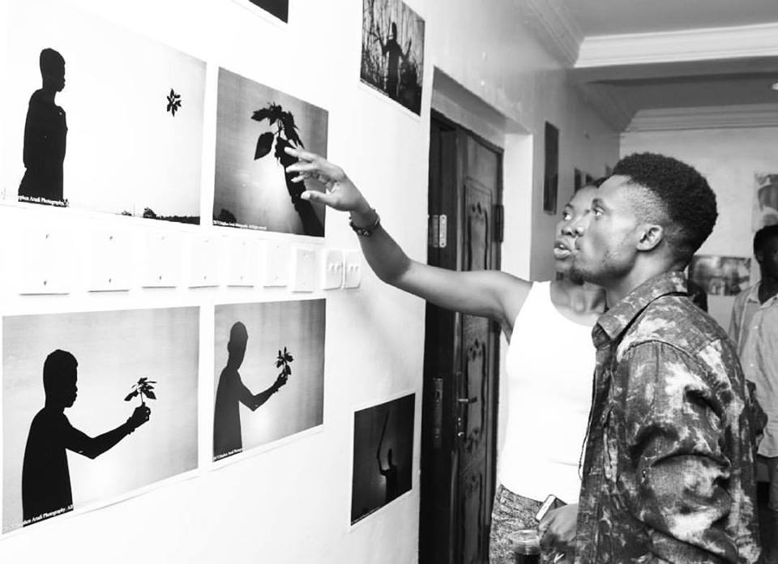

**Summer Summary**

This is Lilian y'all, I know you know but let's allow it. I know you missed me, I know you did, but I'm back now so don't worry much.

From the deepest part of my heart, I sincerely apologize for my inconsistency these past few months. A lot has been going on, though they aren’t enough excuse as to why I haven’t had any post up since June. Happy New Month and Barka da Sallah to my Muslim Friends. (Sallah is past but just let this one go)

Let me start by saying, August didn’t go as I had planned from the beginning of the year. Some things went south for me while some others went well.

Oh well, I want to give you a drop down of some of the important things that took place during the summer.

**In July** I got a phone call from my friend to help assist in a photo shoot for his friend. In all my pride and _mumuness_ I went. I was a bit humble because most of the fac….infact all the faces except one was new to me. So I didn’t get to be me most of the time. Big ups to Aqshotit _I'm still waiting for images mahn_.

**July 27th** Salem Oxford and Wisdom school had their graduation. All my friends were graduating so I had to go. I went with my lil bestie. Imma drop a picture or two from the grad ceremony.

\[gallery ids="1946,1945" type="columns"\]

**August** started normal, I had plans but had to shift them to face other issues/matters arising. I got invited to attend an Art, Music and Drama show. Was in the evening, I wasn’t too impressed with the crowed at the beginning _had gate fee, so not too many people showed up_. It was cool; the Drama presentation was the real deal. The story line was unique, the actors played their roles well and the organization was on point. Lasted till late 10pm, was worth it.

TOM had their Teens and Youth camp, a day after Chapel of freedom commenced theirs which ended on Saturday. On Friday before the last day at camp I went for their Dinner Night and Talent hunt show. The atmosphere was cool, the people were lively,  that was the first day I saw D Professor perform, tbh I wasn’t too impressed _I’m not so easy to impress so no ish_ He is really good at what he does though. Was in the evening so I didn’t get to take any picture

**On the 26th of August**, my good friend Stephen Arudi had his Photo Exhibition at Miami Hotels and Towers. My next post is going to be about it so let’s save the photos for then.

**On the 27th of August**, my buddies Emmanuel, Phavour and Mayorwa had their concert at Salem chapel. It was super though there was a downpour that day which I believe hindered a lot of people and some guests too from showing up. Oh so that's me and D Prof in the first image, then I, D Prof and my fav Phavour.

\[gallery ids="1958,1957,1953" type="columns"\]

It was this summer that really made me realize my pure love for creativity and photography. Well,  it made me realize a lot of things for instance, Nothing good lasts forever, but there’s no harm in trying. Imma try until I know there’s no hope, therefore get ready for disturbance.

\[gallery ids="1936,1935" type="columns"\]

I hold no credit for these images.

Some parts of the summer was fun. Holla to the new few friends I made.

Summer is officially over. Back to work

**Word**: Not every friend is meant to stay. Don’t feel bad when you lose some, you’d surely make new ones. Have Fun!

_Listening to Love Is Wicked by Brick & Lace  madd jam_

_Until Next Time_

_**XoXo**_
