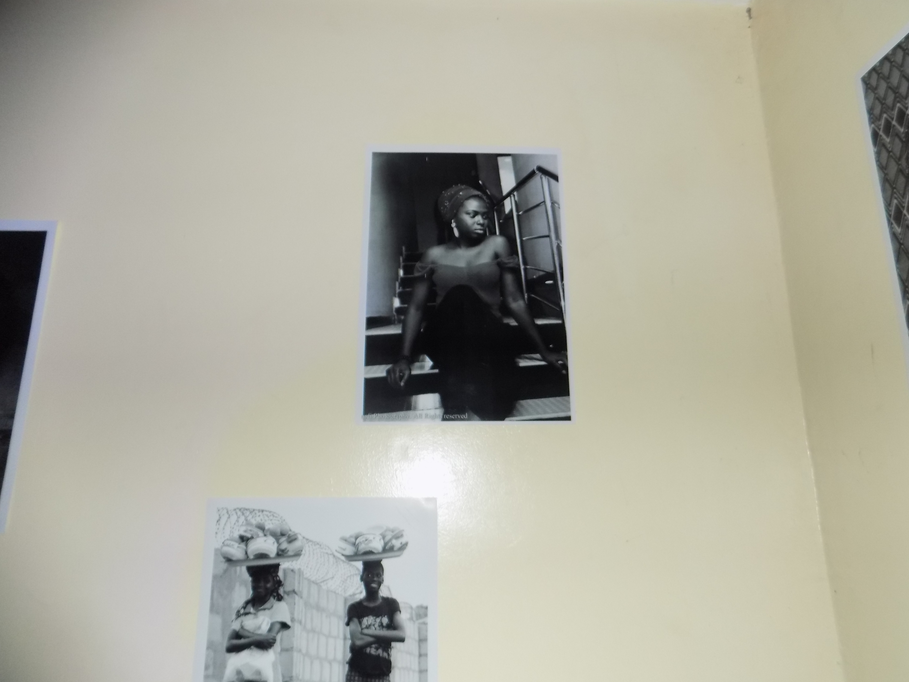
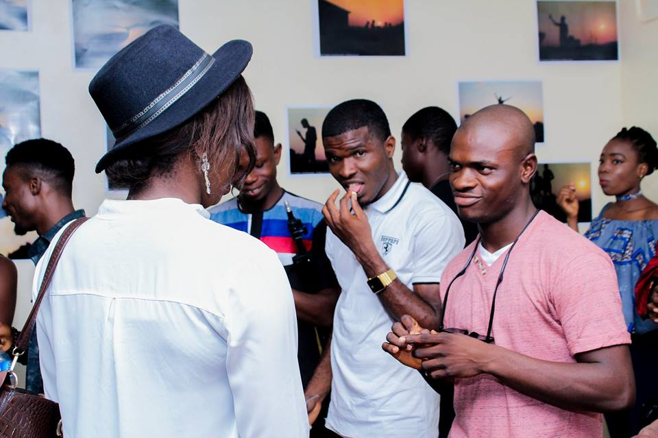

Happy New Week to you birdies, I hope your weekend was awesome. Ayeee, let's get down into this week's post.

**26th of August 2017, 3:00pm**

Have you ever been to an Art exhibition or any Exhibition at all? If not the here's an interesting little tale from the one I attended in August.

**The Mindsight**, a photo exhibit by **Stephen Arudi**

 

"**The MINDSIGHT** is the ability of the mind to focus, The ability of the mind to understand, imagine, or penetrate.

This project is about understanding how the mind works through art, the imaginations that comes by trying to tell a story through art and finally passing such story to people making it sink right inside the soul.... Art is all about the eyes of the MIND.

"If your MIND can see it, your CAMERA can photograph it" (sa photography)"

Nigerians are so bad at keeping up with time, it runs in the blood. Lemma start by saying it was madd amazing when I found this image on the wall, I couldn't stop blushing and smiling all at once, swept me off my feet honestly.

These images are a must have, I sure am getting one before this year runs out. The whole magic behind it is wonderful, the moment was caught in perfection. You'd agree with me that they are amazing.

Enough about the images, Let's talk the audience/crowd/people. The people who attended this event were lively and fun to be around. I really didn't feel alone as one could walk up to anyone and have an interesting conversation. The connection going on was surprisingly great.

\[gallery ids="2000,1994" type="square" columns="2" orderby="rand"\]

\[caption id="attachment\_1956" align="alignnone" width="960"\] Looks like Cypher is making moves on Vivian\[/caption\]

The Small Chops. When I saw this table I just knew that my plans of leaving early had to be on hold until I had those golden round imperfect looking puff puffs. And I did, when the stick of two puff-puff was handed to me, I looked round to see how everyone was handling theirs and I got comfortable. Nobody cared how you ate yours, so my brethen I threw (literally) each ball into my mouth one after the other was digested. Something that gave me joy was when a stick was handed to a young lady standing in front of me, she smiled and was like "oooh yes" _in a calm excited voice_ (can't really remember what she said exactly but her expression I recall)  like she had been waiting to have them. There was more than enough drinks for everyone but I had only a one cup (we don't want to come and be showing eating skills here now, do we?) The popcorn, arhh, thank God I got home before devouring that one, I didn't have the strength to be forming porsh on top popcorn, I needed to let the village girl in me out while taking it in. The first and last time I had a popcorn like this one was early January in Awka, Anambra state Nigeria. I need to meet whoever made this one, she did a wonderful job (if you were there then you probably know how good the popcorn was, not that one we buy from Treasure Bakery _no offence_). Enough about the food.

Rounding up, the event had guest speakers who took their time to explain creativity, mindsight in relation to photography and life. It was the first, the best but surely not the last.

\[gallery ids="1999,1998,1997,1996,1995,1993,1992,1991,1990" type="rectangular" orderby="rand"\]

Next time when I put up an event that y'all should attend, you better do without second thoughts. P.s Stephen you did a great job _winks_

**Word**: Let your life be a creative example to the world.

_Until next time_

**_XoXo_**
