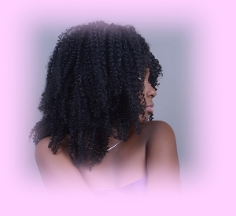

**Take Your Time to Read This**

I don't know Art.

I call a piece of amazing work "Art". I sometimes think myself to be an art work, other times, thought is different.

We are all artworks, our creator designed us differently.

Photography is also art. My love for photography is just crazy. I want to be in front of the camera and behind the camera. Being in front of it is Pure Bliss (lol, I just remembered that biscuit that's called Pure Bliss), being behind it is Imaginative Creativity.

Going through Twitter, VSCO, Instagram and finding out the beauty the Youth creates is mad amazing. I literally want to know this people personally.

Your art can be amazing if you appreciate others and work towards yours.

Be Unique, Be Spectacular. Have a definition and a Concept.

\[gallery ids="1826,1820,1821,1829,1832,1822,1825,1831,1823,1828,1830,1827" type="columns" link="file"\]

> Photography by Chukwuka Nwobi

Visuality is everything, that's why we all have different concepts cause we all see  things from different perspectives.

\[gallery ids="1846,1843,1847,1845,1842,1844" type="rectangular" link="file"\]

Creativity is Key, don't lose it.

\[gallery ids="2114,2107,2112,2109,2110,2108" type="columns"\]

> Photography by Ibidola

Concept is uniqueness, be different.

\[gallery ids="2124,2122,2121,2120,2126,2125" type="columns"\]

> Photography by Asamaiige

After attending **The Mindsight Photography Exhibition by Stephen Arudi**, it is plain clear that creativity and photography is life and there are so many things to learn.

I want to use this post to connect to the wide range of creative photographers out there. You guys are  gems. And to all the photographers I have as friends "Work hard guys and make perfection key, you'll all go places just be consistent and unique" God bless your pockets and shower you with blessings.

If you agree with me say **_Yay!_**

Keep your notifications on for the next post.

_**Until then, XoXo**_.
