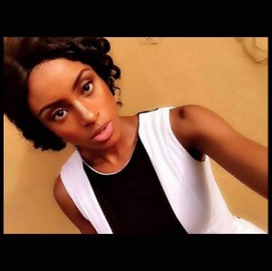

Hello guys, good day and welcome to Lilian's Blog, thank you for clicking on the link.

This is an interview section I had with a Social Media Influencer **Madeleine Ugochi Enyi AKA 9jawitches** who is popular on **NaijaTwitter**. She is known for her participation on different topics on Twitter, her clapbacks that also go a long way as to appear on different pages on Instagram, the wonderful act of giving and the help she renders to her followers. She tells us a bit about herself, how the journey started and how it has been so far. So, let’s read what she had to say.

 

Lilian: Hello Maddie, it's so good to be having this little interview section with you. My readers already know your name and what you do so please be kind to go further and tell us more about yourself. For example, You hail from what state here in Nigeria?

**Maddie: I am from Delta State, Ubulu-uku to be precise.**

Lilian: What University do you attend and what course do you study?

**Maddie: I am studying Psychology in the University of Lagos. 100L student**

Lilian: I would have asked your age, but many females love to keep their ages secret, if you don’t mind, please tell us?

**Maddie: Well, I am 20, lol**

Lilian: Wow, she isn't shy at all. A round of applause to you then. Lol. Apart from being a social media influencer is there any other thing you are presently into?

**Maddie:** **Well. Not really, I am a part-time MUA**

Lilian: I've been wanting to ask if you were a male or female because honestly a lady who takes interest in football is a superwoman, nice work though.

**Maddie:** **Lol! Many people ask me that question. Till now, people still think I am a catfish but well I am not. I just do what I do to make my here on Twitter fun. I just don’t want to be that normal girl, I want to stand out in whatever career I find myself in.**

Lilian:Oh that's cool. If I may ask, when did u start being a Social Media influencer?

**Maddie: Well, let’s just say about two months ago. I started using Twitter actively 3 months ago, I used to just have 7k followers, then I was not popular. I was just a normal user. Then when I started making funny memes & participate in social discussion, I started gaining recognition here. So I can say it took me about a month to gain such strength to becoming a social media influencer**

Lilian: Are your followers supportive?

**Maddie: Yea, my followers are the most supportive. Like, I call them my family. They can be annoying sometimes with their criticism and all but well I think that’s part of the game. I learn from most of them, some I discard because they can be really offensive and not constructive in any way. I owe them a lot cos they expect much from me. I always look forward to making sure this place remains a heaven for we all. Where you pain & frustration can be lifted from daily jokes and clap backs I tweet.**

Lilian: Awwwn, that’s really sweet. I've seen that you are one badass savage, lol, I'm a fan.

**Maddie: Lol! You are? Wow I have a fan? Maddie has a fan? Haha. Thank you**

Lilian: You’re welcome dear. So If I decided that I want to become a Social Media influencer, how would you advise me to go on  that?

**Maddie: Well, the social media influencing game ain’t easy though. It is dominated mostly by men. All I can say is be focus & be creative. Consistency & creativity are the two keys behind my success here as a social media influencer.**

Lilian: I agree, that is key. You help people advertise their businesses right?

**Maddie: Yes I do, I'm a digital marketer.**

Lilian: Okay so, I see you and this other guy are friends on here, uhm Favour Onyeoziri aka Rouvafe

**Maddie: Yea, we are. I have learnt a lot from him. He has been helpful to me here. He helped me stand on my feet. He is a nice guy.**

Lilian: Awwn, a big shout out to him then. Alright, one more thing, are you presently in any relationship cause I'm pretty sure a lot of niggas are in search for a Superwoman to call their own?

**Maddie: No, I don’t want to be distracted by that now. I still got a lot of things to do. Relationship will come later.**

Lilian: For the guys interested, hope y’all heard the lady. Well, Maddie it has been sure a pleasure getting to know you. I really appreciate this but before we round up could you tell us, during your time of being popular and all, what has been your most achieved goal.

**Maddie: My most achieved goal is hitting 5 million impressions on a tweet.**

Lilian: What a wow, that's really impressive you know.

**Maddie: I know right**

Lilian: "If I tell you say I love you oh, my body my money na your own oh baby......" finish it

**Maddie: Bill gate money for my account ti oh**

Lilian: Lol, go girl, you are on point. So what would you like to say to your fans, my readers and Nigeria as a whole?

**Maddie: I will like them to focus & be original in whatever they do regardless of the circumstances they find themselves in. Consistency is key.**

Lilian: Alright guys, y'all have heard from our one and only Badgal, you can follow her on the following social media platforms.

**Maddie: Twitter: [@**badgalmaddie\_**](https://twitter.com/badgalmaddie_) [@**maddieflows**](https://twitter.com/maddieflows) Instagram: badgalmaddie\_ Snapchat: badgal\_maddie**

 

\[gallery ids="2101,2093,2094,2096" type="columns"\]

 

Lilian: Thank you Madeleine.

Incase you would like an Interview with me, do dm me on any social media platform or send in an Email to lilibest30.lb@gmail.com.

_Until next time_

_**XoXo**_
