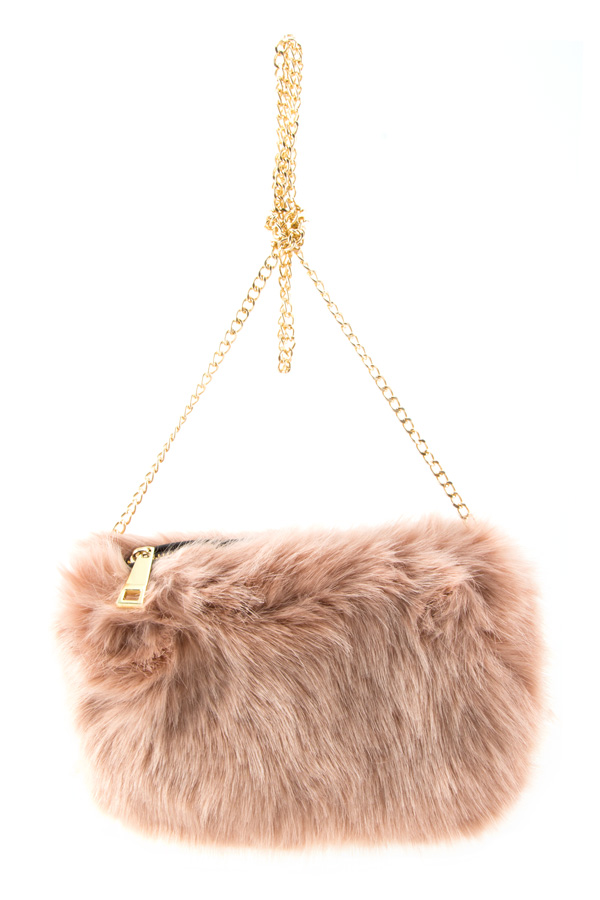
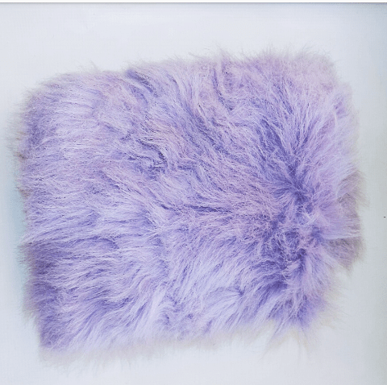
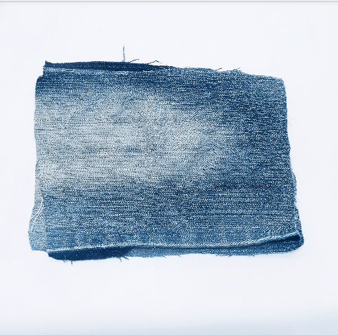
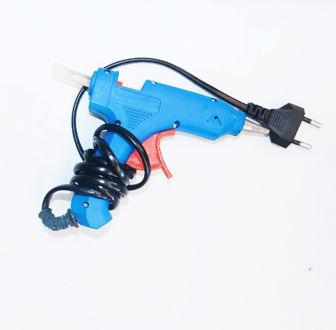
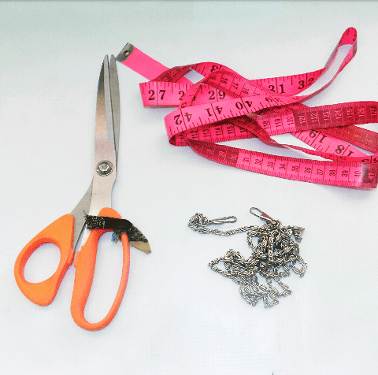
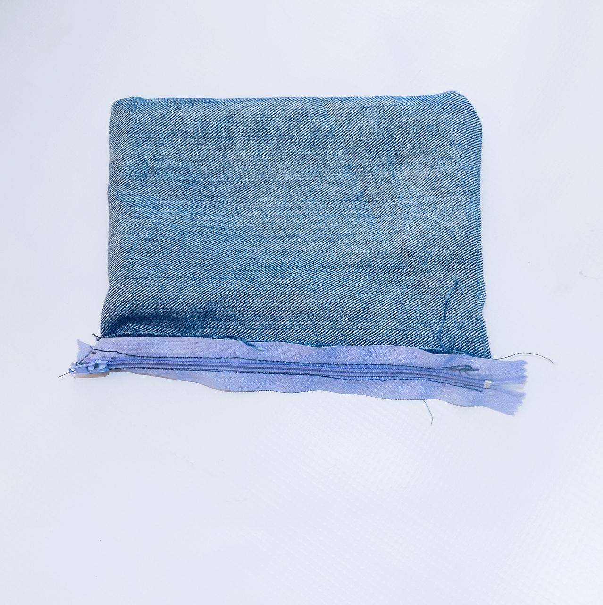
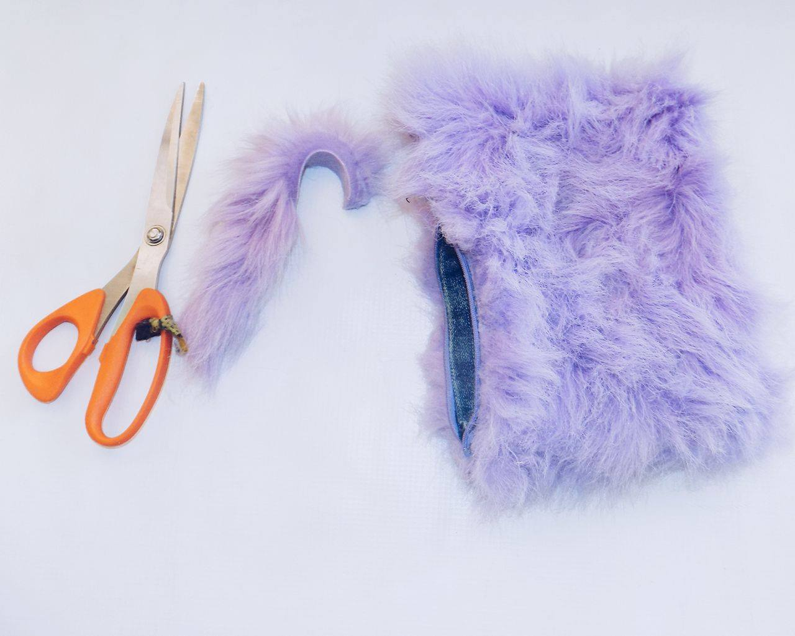
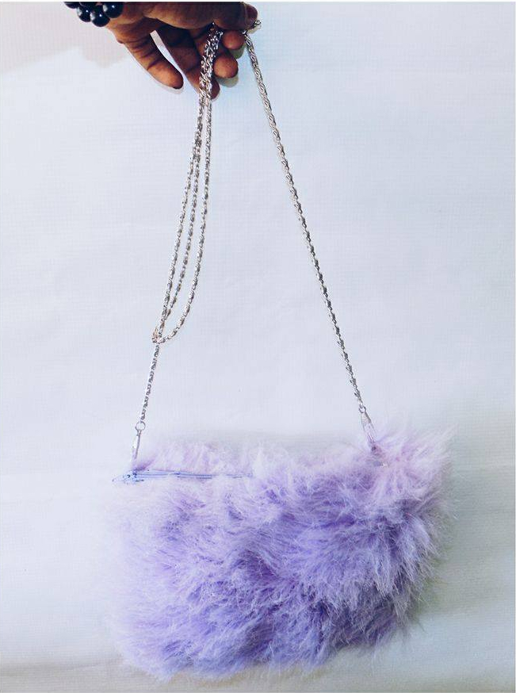
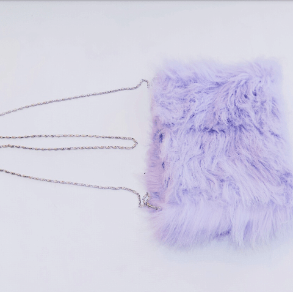
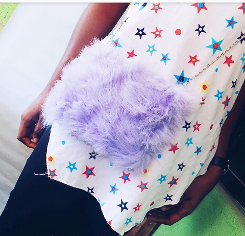

Hello readers,

Welcome to my blog, if you're visiting for the first time, please take your time and checkout my other posts. Meanwhile, for the oldies make sure to like and share.

Today's post is going to be a Diy on how to make a fur faux purse

Let's get straight into it. You'll need the following items;

- Fur material
- Thick material
- Zip
- Bag Chain
- Hot Glue
- Scissors
- Tape
- Needle and Thread or a Sewing Machine
- Pins

\[caption id="attachment\_2753" align="alignnone" width="439"\] Fur material\[/caption\]

\[caption id="attachment\_2749" align="alignnone" width="400"\] Tape, Bag chain, Scissors\[/caption\]

 

First of all, get out the correct measurements of the material you'll need. I didn't use any because I already had a picture of what I wanted in mind so I just made use of the remnant material from a tote bag I made. I made use of jeans material from an old pair.

- Get out the materials, 8cm by 8cm respectively (Choice)
- Sew the sides and bottom of the jeans together and the fix your zip

- Use the same measurement for your fur but it should be an inch or two wider/longer
- Use your hot glue to attach the fur to the jeans
- Trim off the excess materials

- Attach your pins to the sides of the bag, this will serve as a holder for the chain or any other attachments you would like to add (Pum pums)
- Then fix your chain on the pins

Tadaaa, your bag is ready.

\[caption id="attachment\_2755" align="alignnone" width="451"\] Fur Sling Bag\[/caption\]

Just incase you encounter any problem while trying it out, follow me on any of my social media pages and don't hesitate to drop a dm. Thank you for reading, be sure to come back again for another tutorial.

_Until Next Time_

_**XoXo**_

