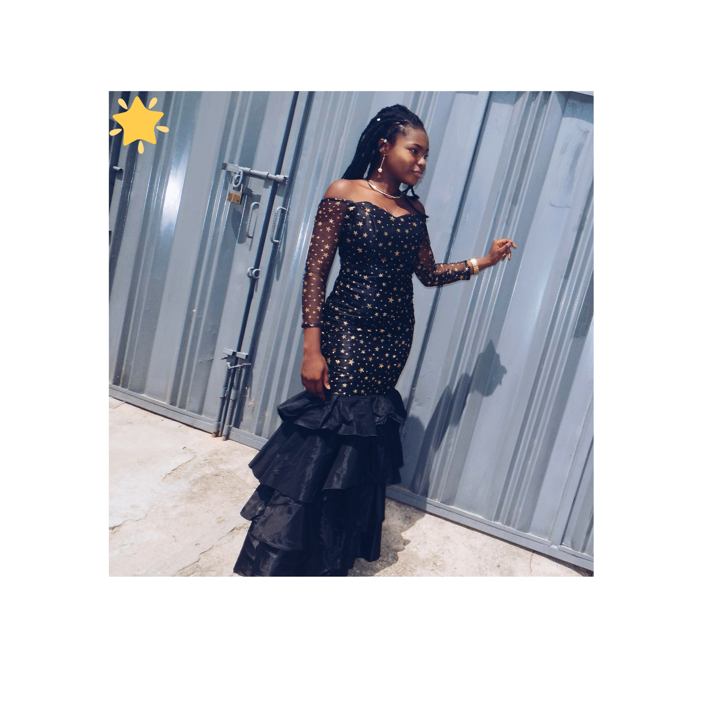
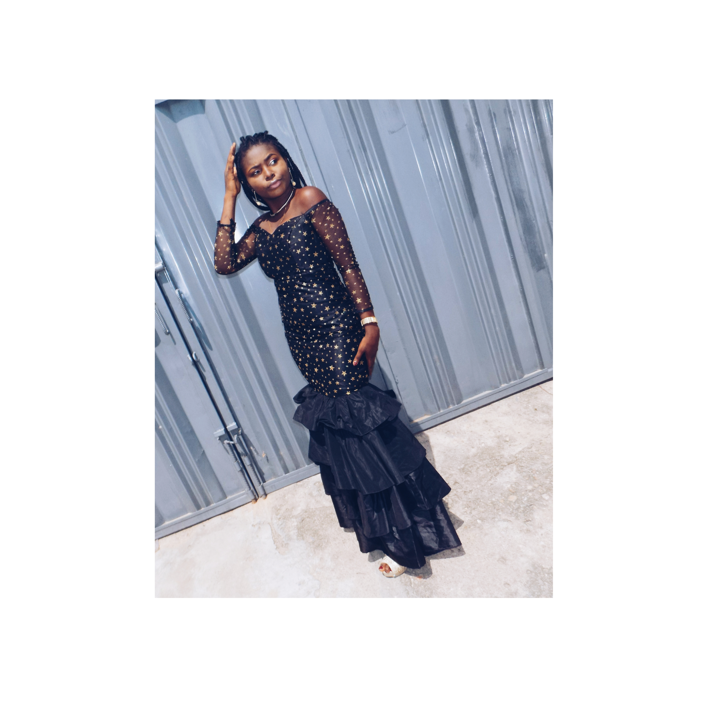
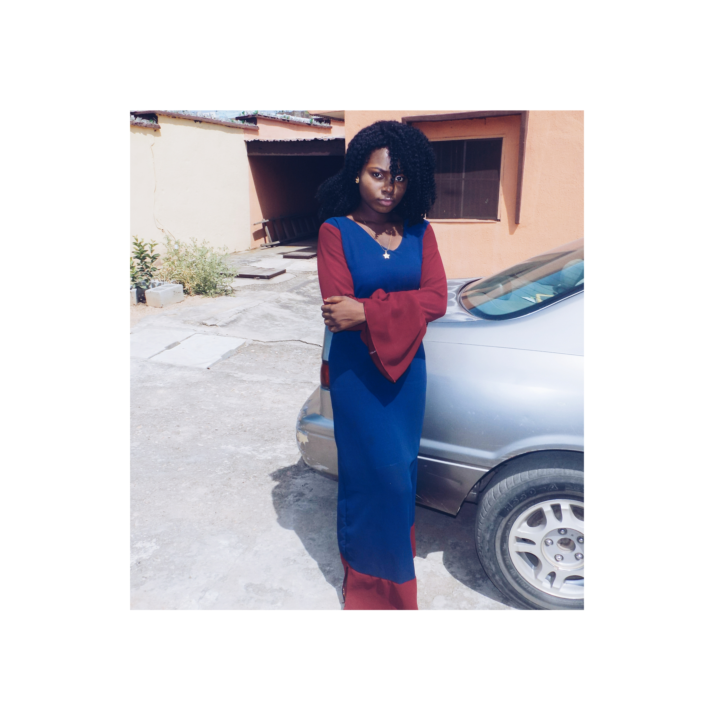
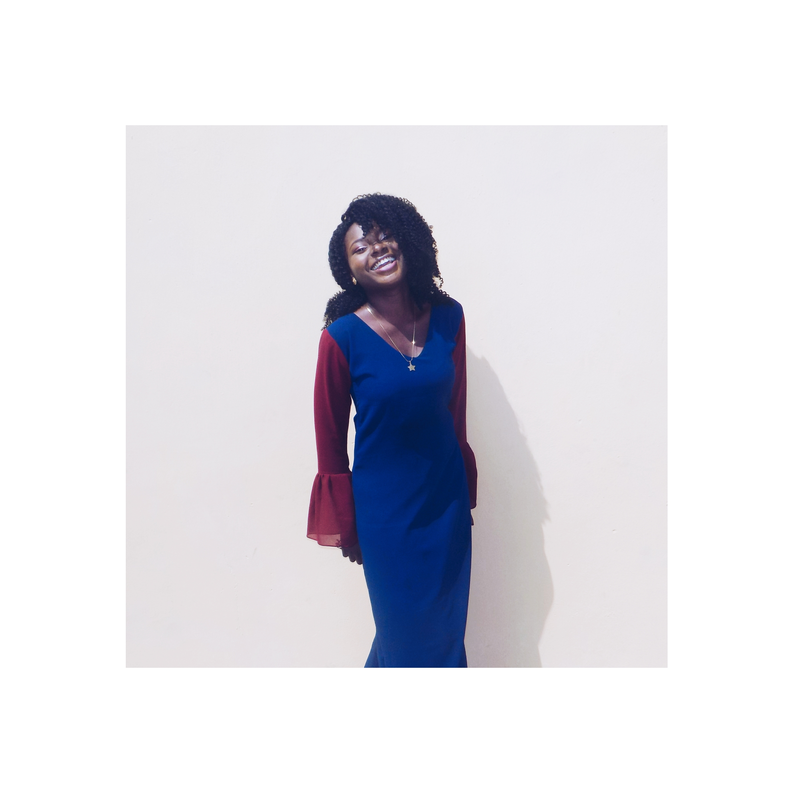
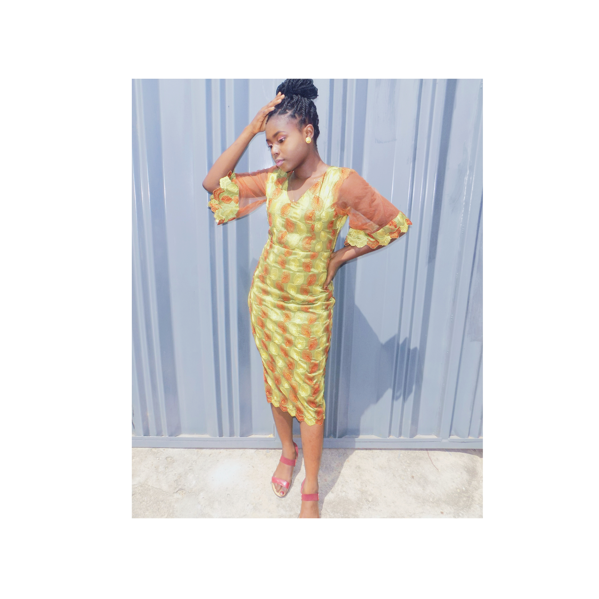
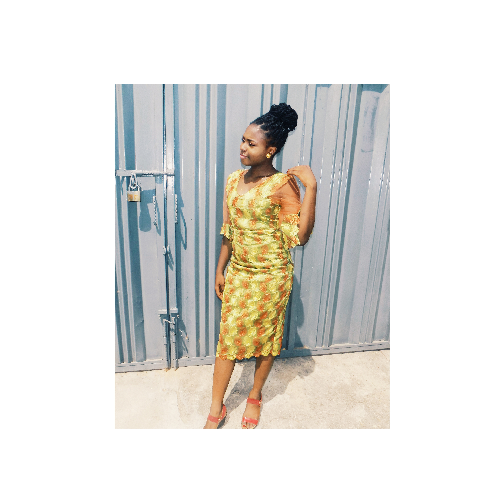
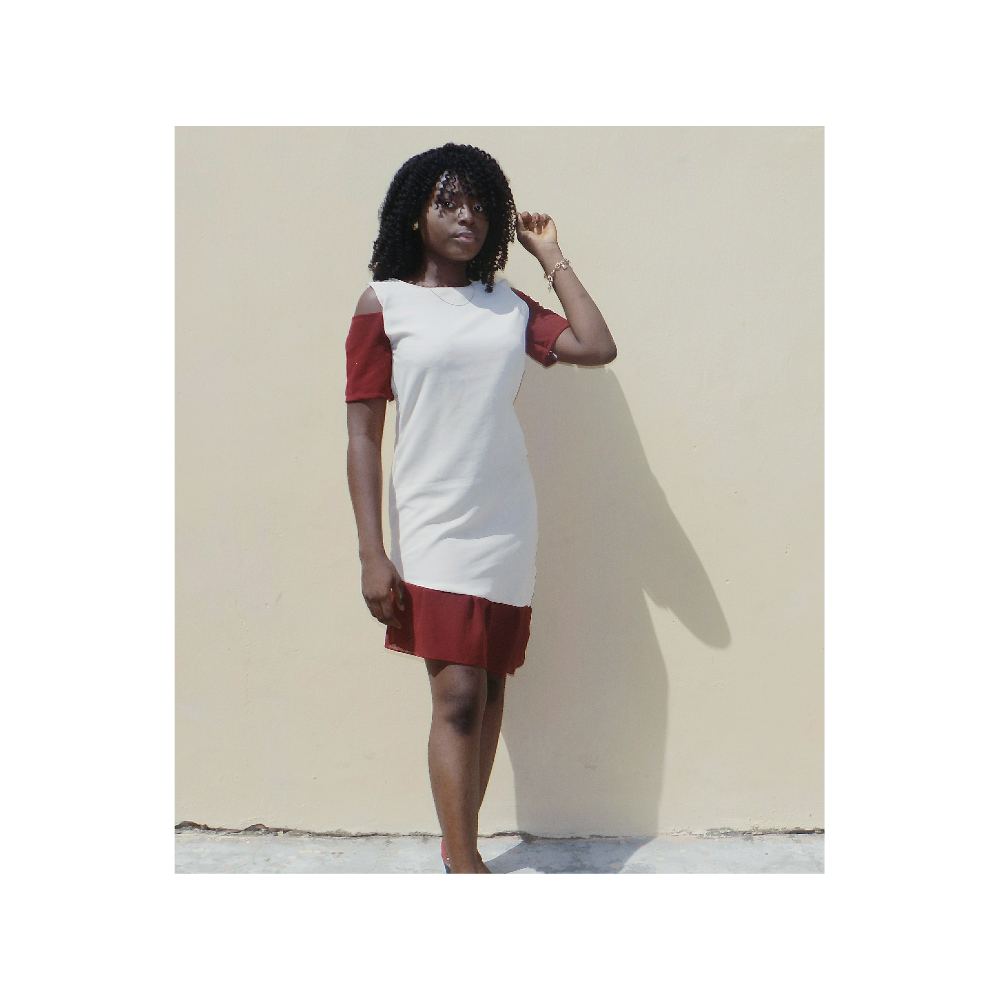

Apparently, it's been one year since I started blogging.

Hurayyyy🎉🎉🎉 

It hasn't been easy trying to be consistent, coming up with blog ideas and all. I decided to give this a shot last year and see how far I could go with it because I knew making videos or being a Youtuber would be a lot harder and since I could write I decided, why not. 

I had lots of plans for my blog this year but I didn't meet up even half of them. Though, that doesn't mean I can't try again. With hope, better things next year. I'm trying to see if I could base my blog solely on Fashion and Beauty.

I would really love to carry both the males and females along but I'm finding it really hard. I know a lotta boys find fashion boring but what can I do. Trying to please the masses would result to me displeasing myself but with the help of you guys, I hope to come up with something brilliant. Lol😅, no one should advise me to take on Breaking News or Gossips, I am so not interested. Basically speaking, I'm not trying to be Linda Ikeji so Y'all should chill on that. If you have any ideas on what I can do to improve my blog, pleaseee drop a comment.

I wanna say a big thank you to all my lovely friends who take out there time to read my poss and share it, you all are heaven sent. God bless. Also, I wanna give a shoutout to my Girlfriend Stephanie Chiamaka Ajifa, Happy Birthday Baby girl❤️😘

I really don't have much to share, keep visiting my blog, keep sharing, keep liking and keep commenting. I love y'all❤️😘

Here are a few of my designs from October this year (I was only 5 months into designing). Yeah yeah, go ahead and screenshot😅 

 

\[caption id="attachment\_2787" align="alignnone" width="490"\] Mermaid Gown (Prom Dress) Sweetheart neckline\[/caption\]

\[caption id="attachment\_2793" align="alignnone" width="391"\] Chiffon Straight dress withBell Sleeves and Double bow at the back\[/caption\]

\[caption id="attachment\_2788" align="alignnone" width="398"\] Straight Dress with Triangle Sleeves\[/caption\]

\[caption id="attachment\_2792" align="alignnone" width="3864"\] Straight Gown with Bell sleeves ((peplum)\[/caption\]

 

\[caption id="attachment\_2786" align="alignnone" width="3282"\] Asymmetric Cold Shoulder dress\[/caption\]

 

 

**CONGRATULATIONS TO ME AGAIN**. The journey just got started.

_Until Next Time_

**_XoXo_**
