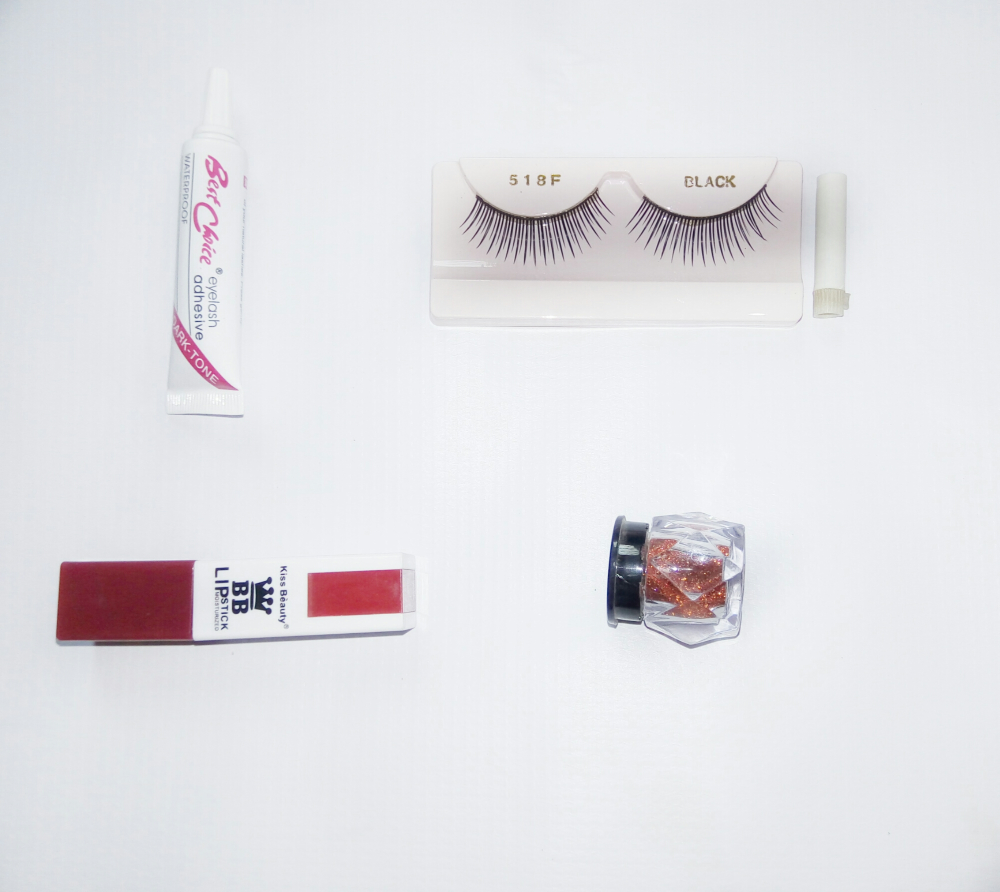

Cha cha cha

Hey there lovely humans

I'm really excited to be writing this, not because of its content but because of one of my previous [Post](https://lilistargazer.wordpress.com/2017/01/20/my-homemade-deep-conditioner/) and how much love was shown to me. I'm super grateful for that.

Moving on to this week's post; I went to some cosmetic store few weeks ago and I got myself a lipstick, false eyelashes, an adhesive and an eye glitter. Was crazy excited about the shade of the Matte lipstick I got and the lashes I so much wanted.

I tried on the lipstick and it was fine baby but, I couldn't just get the lashes in right.

Tutorials upon tutorials and it isn't still working, I'm gonna have to pass. The glitter was/is bomb, fits me well. Honestly needs someone who'd personally teach me how to fix this false lashes, please don't hesitate to hit me up.

Until next time

_XoXo_
