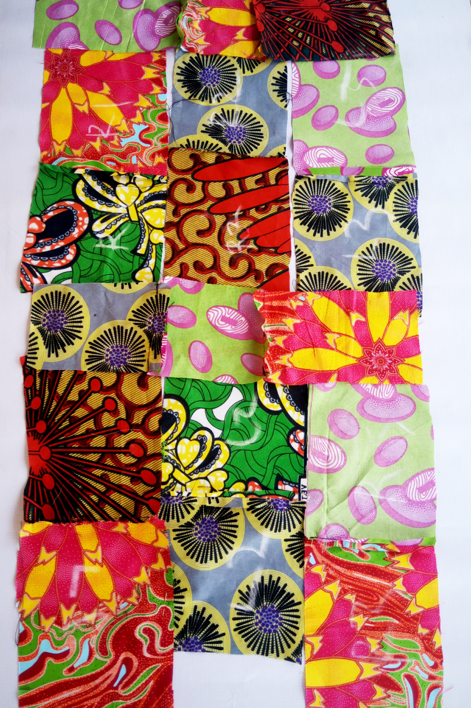
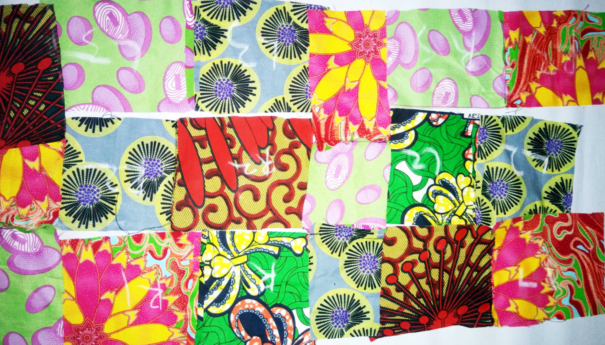
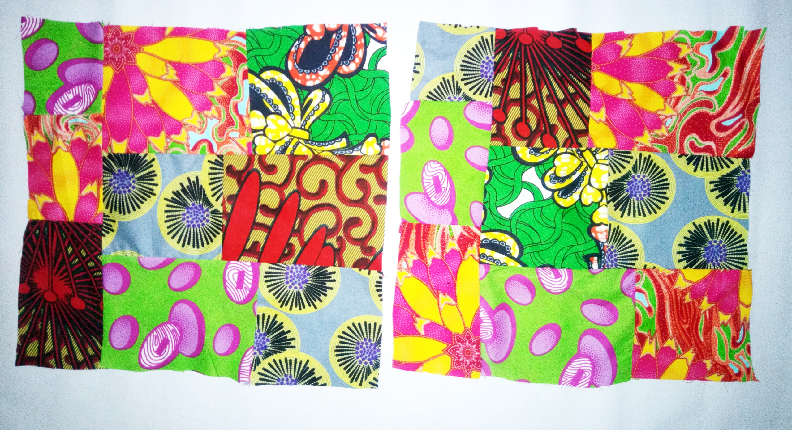
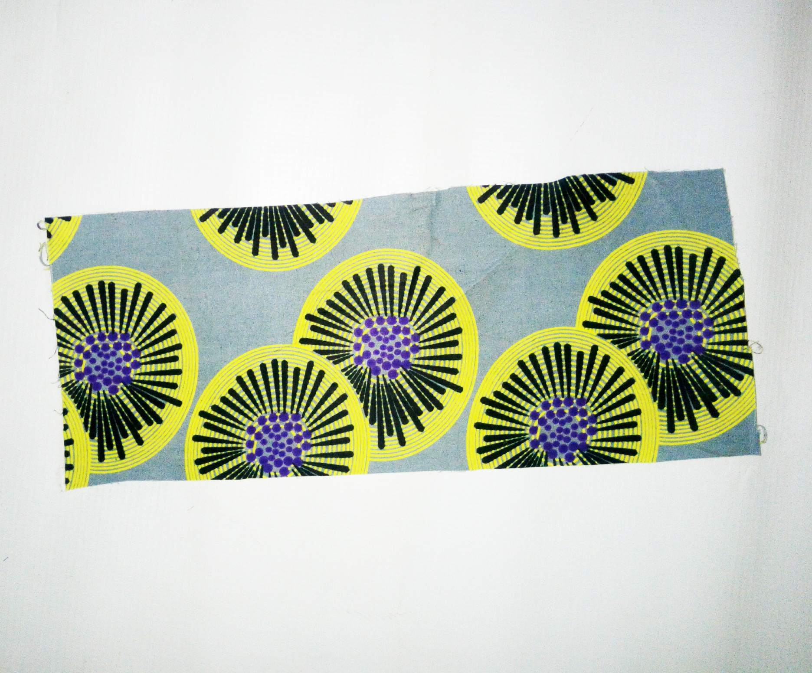
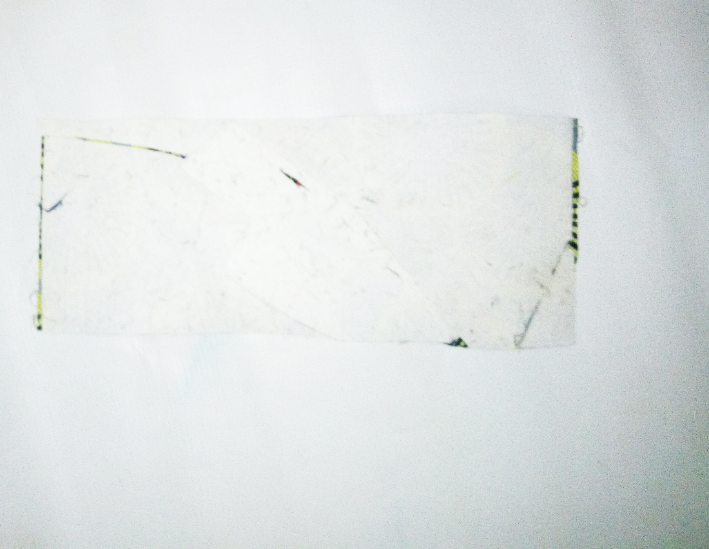

Hey yo!

Do you wish to have an Ankara tote bag in your closet? If yes, then this post is for you. It's quite easy to do anything if you put your mind it. Making a patch ankara bag is as easy as ABC when you have the required materials at hand. What you'll need;

- Different designs of ankara material
- Scissors
- Tape rule
- Needle and thread or sewing machine
- Gumstay

Very few things needed. Follow the images

- Cut your ankara pieces into square shapes, make sure they are all the same measurement except for the sides. I didn't make use of any specific measurement, some pieces are square shaped others are rectangle and some others are smaller squares.

- Then align them down like this. Make sure you arrange them to give you the same width and length (12 by 12 depending on choice)

- Join them together with your hand needle or sewing machine (I recommend a sewing machine for a cleaner and long lasting work)

- For the bottom part, 4inches + 1 inch for sewing allowance

   

- Cut out 5 inches too from the gumstay (make sure it is the thick gumstay) and attach it to the bottom part with a pressing iron. My bottom is a single ankara pieces.
- Then for the sides, use the same measurement for the bottom. You can also attach the gumstay to it (I didn't though). My sides are also squares but smaller squares.
- Now join the side part and the body, before joining the bottom or however you feel like
- All the lengths should be equal before folding the mouth/end by 1 inch or half
- Make 2 hands for the bag . Width= 1 inch or 1 and half, Length can be as long as you want
- Attach the hands to each body.

Tadda, your Ankara tote bag is ready. Make sure to use pretty designs so it comes out really colourful and eye-catching.

