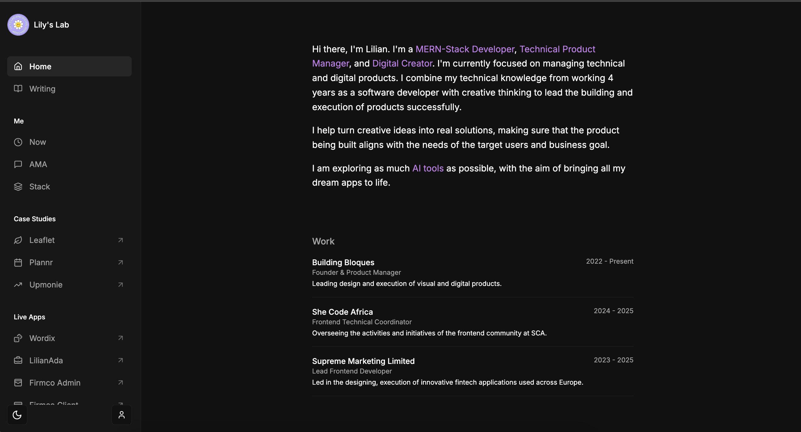

# Lily's Lab

A modern, responsive portfolio website built with Next.js, Tailwind CSS, and Notion as a CMS. This project serves as a personal website showcasing work experience, projects, writing, and more.

## 🌟 Features

- **Modern Design**: Clean, minimalist design with dark/light mode support
- **Responsive Layout**: Optimized for all device sizes
- **Notion-Powered CMS**: Content managed through Notion databases
- **Firebase Authentication**: User authentication for interactive features
- **Interactive Components**:
  - Ask Me Anything (AMA) section
  - Article comments with admin replies
  - Article likes
  - Resource sharing
  - App dissection case studies
- **SEO Optimized**: Meta tags, Open Graph, and structured data
- **Performance Optimized**: Fast loading times and optimized assets

## 🛠️ Tech Stack

- **Frontend**: Next.js 14 (App Router), React 18, Tailwind CSS
- **Authentication**: Firebase Authentication
- **Database**: Notion API (as headless CMS)
- **Styling**: Tailwind CSS, shadcn/ui components
- **Deployment**: Vercel

## 📁 Project Structure

\`\`\`
portfolio-dashboard/
├── app/                    # Next.js App Router
│   ├── api/                # API routes
│   ├── writing/            # Blog section
│   ├── ama/                # Ask Me Anything section
│   ├── playground/         # Playground section (app dissections, resources)
│   ├── now/                # Now page
│   ├── stack/              # Tech stack page
│   ├── globals.css         # Global styles
│   ├── notion.css          # Notion-specific styles
│   └── layout.tsx          # Root layout
├── components/             # Reusable components
│   ├── ui/                 # UI components (shadcn/ui)
│   ├── notion/             # Notion-specific components
│   ├── sidebar.tsx         # Sidebar navigation
│   └── ...                 # Other components
├── contexts/               # React contexts
│   └── auth-context.tsx    # Authentication context
├── hooks/                  # Custom React hooks
├── lib/                    # Utility functions and libraries
│   ├── notion.ts           # Notion API integration
│   ├── firebase.ts         # Firebase configuration
│   └── utils.ts            # Utility functions
├── public/                 # Static assets
└── ...                     # Configuration files
\`\`\`

## 🧩 Key Components

### Notion Integration

The website uses Notion as a headless CMS, with several databases:

- **Articles/Writing**: Blog posts with rich text content
- **Projects**: Portfolio projects
- **Work Experience**: Professional experience
- **Speaking**: Speaking engagements
- **App Dissections**: In-depth analyses of applications
- **Resources**: Useful resources and tools
- **AMA**: Ask Me Anything questions and answers
- **Comments**: Article comments

The integration is handled through the Notion API, with both official and unofficial clients:
- Official client (`@notionhq/client`) for database queries
- Unofficial client (`notion-client`) for rich text content rendering

### Authentication System

Firebase Authentication is used to enable interactive features:

- Google sign-in for users
- Admin authentication for special privileges
- User profiles with avatars

### Interactive Features

1. **Article Interactions**:
   - Like/unlike articles
   - Comment on articles
   - Admin replies to comments

2. **Ask Me Anything (AMA)**:
   - Users can submit questions
   - Admin can answer questions
   - Questions are displayed in a feed

3. **App Dissections**:
   - In-depth analyses of applications
   - Rich media content with images and videos
   - Categorized by type

4. **Resources**:
   - Shared resources with download links
   - Categorized by type
   - External links to resources

### UI Components

The UI is built with a combination of custom components and shadcn/ui:

- **Navigation**: Sidebar for desktop, sheet for mobile
- **Theme Toggle**: Light/dark mode support
- **User Profile**: User information and authentication status
- **Notion Renderer**: Custom renderer for Notion content
- **Comments Section**: Threaded comments with replies
- **Toast Notifications**: Feedback for user actions

## 🚀 Setup and Installation

1. **Clone the repository**:
   \`\`\`bash
   git clone https://github.com/yourusername/portfolio-dashboard.git
   cd portfolio-dashboard
   \`\`\`

2. **Install dependencies**:
   \`\`\`bash
   npm install
   \`\`\`

3. **Set up environment variables**:
   Create a `.env.local` file with the following variables:
   \`\`\`
   # Notion
   NOTION_API_KEY=your_notion_api_key
   NOTION_DATABASE_ID=your_notion_database_id
   NOTION_SPEAKING_DATABASE_ID=your_notion_speaking_database_id
   NOTION_PROJECTS_DATABASE_ID=your_notion_projects_database_id
   NOTION_WORK_DATABASE_ID=your_notion_work_database_id
   NOTION_APP_DISSECTION_DATABASE_ID=your_notion_app_dissection_database_id
   NOTION_RESOURCES_DATABASE_ID=your_notion_resources_database_id
   NOTION_AMA_DATABASE_ID=your_notion_ama_database_id
   NOTION_COMMENTS_DATABASE_ID=your_notion_comments_database_id

   # Firebase
   NEXT_PUBLIC_FIREBASE_API_KEY=your_firebase_api_key
   NEXT_PUBLIC_FIREBASE_AUTH_DOMAIN=your_firebase_auth_domain
   NEXT_PUBLIC_FIREBASE_PROJECT_ID=your_firebase_project_id
   NEXT_PUBLIC_FIREBASE_STORAGE_BUCKET=your_firebase_storage_bucket
   NEXT_PUBLIC_FIREBASE_MESSAGING_SENDER_ID=your_firebase_messaging_sender_id
   NEXT_PUBLIC_FIREBASE_APP_ID=your_firebase_app_id
   \`\`\`

4. **Run the development server**:
   \`\`\`bash
   npm run dev
   \`\`\`

5. **Open your browser**:
   Navigate to `http://localhost:3000`

## 🔑 Environment Variables

### Notion Configuration

- `NOTION_API_KEY`: Your Notion API key
- `NOTION_DATABASE_ID`: Main articles database ID
- `NOTION_SPEAKING_DATABASE_ID`: Speaking engagements database ID
- `NOTION_PROJECTS_DATABASE_ID`: Projects database ID
- `NOTION_WORK_DATABASE_ID`: Work experience database ID
- `NOTION_APP_DISSECTION_DATABASE_ID`: App dissection database ID
- `NOTION_RESOURCES_DATABASE_ID`: Resources database ID
- `NOTION_AMA_DATABASE_ID`: AMA questions database ID
- `NOTION_COMMENTS_DATABASE_ID`: Comments database ID

### Firebase Configuration

- `NEXT_PUBLIC_FIREBASE_API_KEY`: Firebase API key
- `NEXT_PUBLIC_FIREBASE_AUTH_DOMAIN`: Firebase auth domain
- `NEXT_PUBLIC_FIREBASE_PROJECT_ID`: Firebase project ID
- `NEXT_PUBLIC_FIREBASE_STORAGE_BUCKET`: Firebase storage bucket
- `NEXT_PUBLIC_FIREBASE_MESSAGING_SENDER_ID`: Firebase messaging sender ID
- `NEXT_PUBLIC_FIREBASE_APP_ID`: Firebase app ID

## 📊 Notion Database Structure

### Articles Database

| Property   | Type       | Description                       |
|------------|------------|-----------------------------------|
| Title      | Title      | Article title                     |
| Slug       | Rich Text  | URL slug for the article          |
| Date       | Date       | Publication date                  |
| Published  | Checkbox   | Whether the article is published  |
| Excerpt    | Rich Text  | Short description of the article  |
| Cover      | Files      | Cover image for the article       |
| Tags       | Multi-select| Article tags                     |
| Likes      | Number     | Number of likes                   |

### Comments Database

| Property       | Type       | Description                       |
|----------------|------------|-----------------------------------|
| Name           | Title      | Commenter's name                  |
| Comment        | Rich Text  | Comment content                   |
| Slug           | Rich Text  | Article slug the comment belongs to |
| Date           | Date       | Comment date                      |
| Published      | Checkbox   | Whether the comment is published  |
| Status         | Select     | Comment status (Pending/Approved/Answered) |
| Email          | Email      | Commenter's email (optional)      |
| PhotoURL       | URL        | Commenter's photo URL (optional)  |
| Parent Comment | Relation   | Parent comment for replies        |
| Reply          | Rich Text  | Admin reply to the comment        |

Similar structures exist for other databases (Projects, Work, Speaking, etc.)

## 🔄 Deployment

This project is designed to be deployed on Vercel:

1. **Push to GitHub**:
   \`\`\`bash
   git push origin main
   \`\`\`

2. **Connect to Vercel**:
   - Create a new project on Vercel
   - Connect to your GitHub repository
   - Configure environment variables
   - Deploy

3. **Custom Domain** (optional):
   - Add your custom domain in Vercel settings
   - Configure DNS settings

## 🧠 Admin Features

To set up admin access:

1. Sign in with your Google account
2. Add your email to the `admins` collection in Firebase Firestore with the following structure:
   \`\`\`
   {
     isAdmin: true,
     createdAt: [timestamp],
     isLoggedIn: true
   }
   \`\`\`

Admin features include:
- Replying to comments
- Answering AMA questions
- Special admin badge display

## 🤝 Contributing

Contributions are welcome! Please feel free to submit a Pull Request.

1. Fork the repository
2. Create your feature branch (`git checkout -b feature/amazing-feature`)
3. Commit your changes (`git commit -m 'Add some amazing feature'`)
4. Push to the branch (`git push origin feature/amazing-feature`)
5. Open a Pull Request

## 📄 License

This project is licensed under the MIT License - see the LICENSE file for details.

## 🙏 Acknowledgements

- [Next.js](https://nextjs.org/)
- [Tailwind CSS](https://tailwindcss.com/)
- [shadcn/ui](https://ui.shadcn.com/)
- [Notion API](https://developers.notion.com/)
- [Firebase](https://firebase.google.com/)
- [Vercel](https://vercel.com/)
- [Lucide Icons](https://lucide.dev/)
